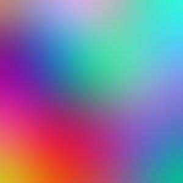
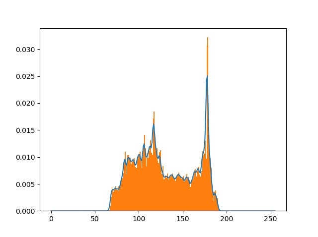
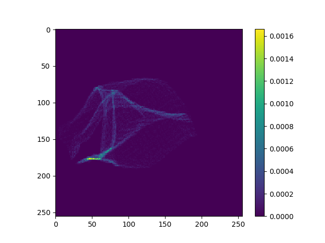

# pytorch-mutual-information
### Batch computation of mutual information and histogram2d in Pytorch

This implementation uses [kernel density estimation](https://en.wikipedia.org/wiki/Multivariate_kernel_density_estimation) with a gaussian kernel to calculate histograms and joint histograms. We use a diagonal bandwidth matrix for the multivariate case, which allows us to decompose the multivariate kernel as the product of each univariate kernel. From wikipedia,

<p align="center">
<a href="https://www.codecogs.com/eqnedit.php?latex=\begin{align*}&space;K_\mathbf{H}(\mathbf{x})&={(2&space;\pi)^{-d/2}}&space;\mathbf{|H|}^{-1/2}&space;e^{&space;-\frac{1}{2}\mathbf{x^T}\mathbf{H^{-1}}\mathbf{x}&space;}&space;\\&space;&={(2&space;\pi)^{-d/2}}&space;\mathbf{|H|}^{-1/2}&space;e^{-\frac{1}{2}(\frac{x_1^2}{h_1}&space;&plus;&space;\frac{x_2^2}{h_2}))}&space;\\&space;&={(2&space;\pi)^{-d/2}}&space;\mathbf{|H|}^{-1/2}&space;e^{-\frac{x_1^2}{2h_1}}e^{-\frac{x_2^2}{2h_2}}&space;\end{align*}" target="_blank"></a>
</p>

where the bandwith matrix

<p align="center">
<a href="https://www.codecogs.com/eqnedit.php?latex=\mathbf{H}&space;=&space;\begin{pmatrix}&space;h_1&space;&&space;0\\&space;0&space;&&space;h_2&space;\end{pmatrix}" target="_blank" align='center'></a>
</p>

## Example usage
---
### Setup
```python
device = 'cuda:0'

img1 = Image.open('grad1.jpg').convert('L')
img2 = Image.open('grad.jpg').convert('L')

img1 = transforms.ToTensor() (img1).unsqueeze(dim=0).to(device)
img2 = transforms.ToTensor() (img2).unsqueeze(dim=0).to(device)

# Pair of different images, pair of same images
input1 = torch.cat([img2, img2])
input2 = torch.cat([img1, img2])

B, C, H, W = input1.shape   # shape: (2, 1, 300, 300)
```

### Histogram usage:
```python
hist = histogram(input1.view(B, H*W), torch.linspace(0,255,256), sigma)
```

### Histogram 2D usage:
```python
hist = histogram2d(input1.view(B, H*W), input2.view(B, H*W), torch.linspace(0,255,256), sigma)
```

### Mutual Information (of images)

```python
MI = MutualInformation(num_bins=256, sigma=0.4, normalize=True).to(device)
score = MI(input1, input2)
```

## Results
---
### Histogram 


<p align="middle">
    
    
</p>

### Joint Histogram
<p align="middle">
    
    
    
</p>
